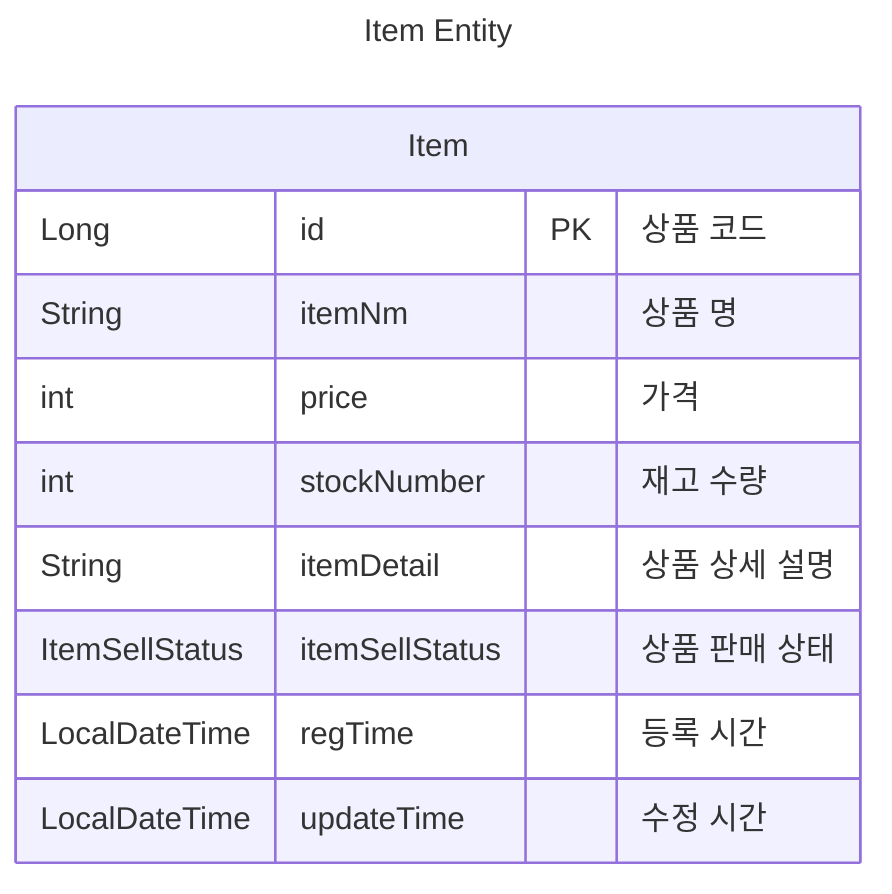

# 스프링 부트를 이용한 쇼핑몰 제작 연습 프로젝트

*****

* 위 프로젝트는 해당 책을 읽으며 진행했습니다.

<div style="text-align: center">
    
    <br/> 
    <div><a href="https://product.kyobobook.co.kr/detail/S000001624717">백견불여일타 스프링 부트 쇼핑몰 프로젝트 with JPA</a></div>
</div>
<br/>

### 왜 이 책으로 연습 프로젝트를 진행했는가?
* 현업에서 사용하고 있는 기술들이지만, 제대로 이해하고 싶었기 때문
* 책의 이름과 같이 한번 따라해보며(내 멋대로 변형시키며) 프로젝트를 완성해보고 싶었음
* 프로젝트 완성을 바탕으로, 필요한 기술들을 찾아서 더욱 깊이 공부하기 위해

> 각 단계를 공부하면서 삽질, 공부한 기록을 브랜치마다 단계별로 README에 남겼습니다 
<br/>

*****

1. 환경 설정
* .gitignore에 java관련(class, package 등), application.properties, application.yaml 등록
* MySQL 관련 작업
  * 버전 9.1.0 고정
  * MySQL은 Docker Container를 이용하기 위하여 컨테이너 구동 후 데이터베이스 권한 작업 진행
    * 추후 새로운 계정 만들어서 계정 권한 세부적으로 조정 예정
  
      `grant all privileges on *.* to 'root'@'%';`
    * MySQL 데이터베이스 테스트 연결 성공
    
    <br/>

      

*****

2. 상품 엔티티 설계

* Item 엔티티는 다음과 같이 설계 됨


* 실행했을 때, 테이블이 생성되지 않는 현상 발생
  * 처음에는 JPA 관련 설정을 하지 않은 줄 알고 구글링을 진행(~~삽질~~)
  * 한참을 뒤져 본 결과, application.yml 내의 ddl-auto 위치 설정이 잘 못 되어 있었다.
    * 수정 전
      ```yaml
      # ...
      jpa:
        properties:
          hibernate:
            # Print Console Processing Query
            show_sql: true
            # Formatting Printed Query
            format_sql: true
            # Strategy Database initialization
            ddl-auto: create
      # ...
      ```
    * 수정 후
      ```yaml
      # ...
      jpa:
        hibernate:
          # Strategy Database initialization
          ddl-auto: create
        properties:
          hibernate:
          # Print Console Processing Query
          show_sql: true
          # Formatting Printed Query
          format_sql: true
      # ...
      ```
    설정시의 위치를 잘 살펴보자!